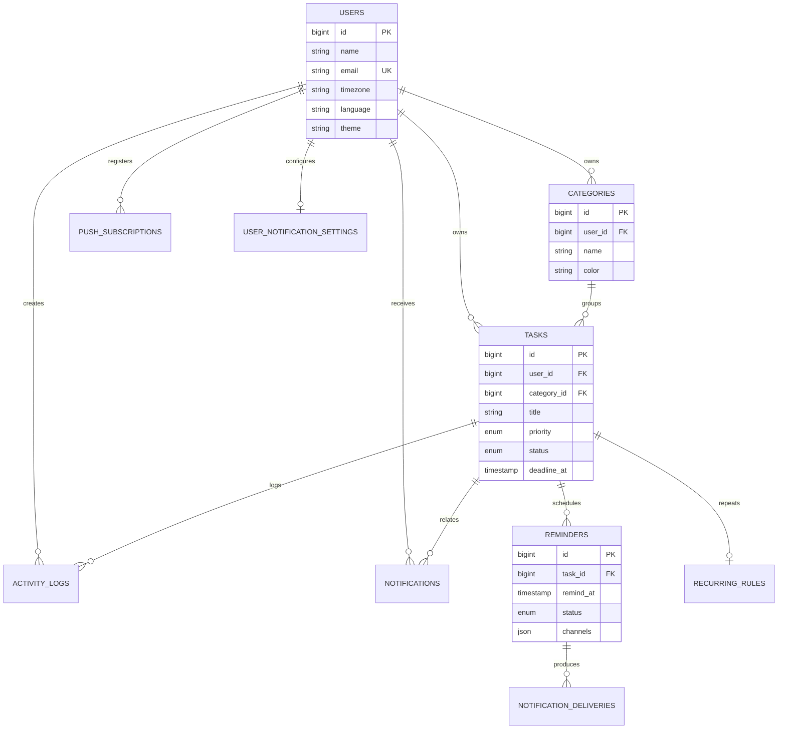

# Remindly ERD

```mermaid
erDiagram
    USERS ||--o{ CATEGORIES : owns
    USERS ||--o{ TASKS : owns
    USERS ||--o{ ACTIVITY_LOGS : creates
    USERS ||--o{ NOTIFICATIONS : receives
    USERS ||--o{ PUSH_SUBSCRIPTIONS : registers
    USERS ||--o| USER_NOTIFICATION_SETTINGS : configures
    CATEGORIES ||--o{ TASKS : groups
    TASKS ||--o{ REMINDERS : schedules
    TASKS ||--o| RECURRING_RULES : repeats
    TASKS ||--o{ ACTIVITY_LOGS : logs
    REMINDERS ||--o{ NOTIFICATION_DELIVERIES : produces
    TASKS ||--o{ NOTIFICATIONS : relates

    USERS {
        bigint id PK
        string name
        string email UK
        string timezone
        string language
        string theme
    }
    CATEGORIES {
        bigint id PK
        bigint user_id FK
        string name
        string color
    }
    TASKS {
        bigint id PK
        bigint user_id FK
        bigint category_id FK
        string title
        enum priority
        enum status
        timestamp deadline_at
    }
    REMINDERS {
        bigint id PK
        bigint task_id FK
        timestamp remind_at
        enum status
        json channels
    }
```
